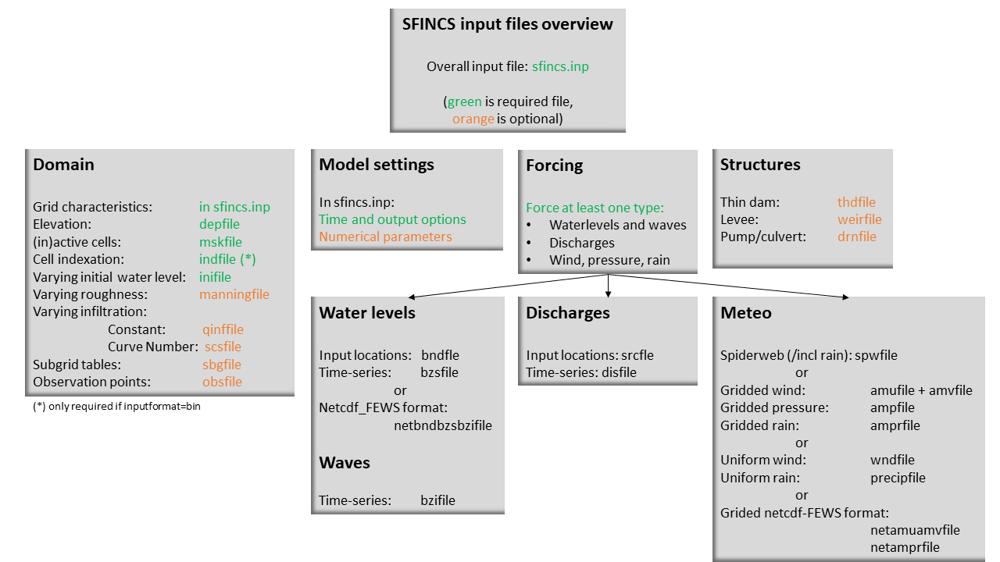

Input description
=======

Overview
----------------------

The input for SFINCS is supplied using various text and binary files, which are linked through the main input file: sfincs.inp.
Within this section of the input description all major input settings and files are discussed.
The figure below gives an overview of all different types of input files and whether they are required or not.
Below an example is given of this file, which uses a keyword/value layout. 
For more information regarding specific parameters see the pages 'Input parameters' or 'Output parameters'.

   Overview of input file of SFINCS with indication whther they are required or not

**Example of: sfincs.inp**

.. code-block:: text

	x0              = 0
	y0              = 0	
	mmax            = 100
	nmax            = 100
	dx              = 100
	dy              = 100
	rotation        = 0
	
	depfile         = sfincs.dep
	mskfile         = sfincs.msk
	indexfile       = sfincs.ind

	bndfile         = sfincs.bnd
	bzsfile         = sfincs.bzs
	spwfile         = sfincs.spw
	amprfile        = sfincs.ampr

	advection	= 0
	alpha           = 0.75
	huthresh	= 0.05
	manning         = 0.04	
	theta 		= 0.9
	qinf            = 0.0

	tref            = 20180000 000000
	tstart          = 20180000 000000
	tstop           = 20180001 000000
	
	dtout           = 3600
	dtmaxout        = 86400	
	dthisout        = 600

	inputformat     = bin
	outputformat    = net
	
	zsfile          = zs.dat
	hmaxfile        = hmax.dat
	
	obsfile         = sfincs.obs
	

Grid & bathymetry
----------------------

Grid
SFINCS uses a staggered equidistant recti-linear grid, grid sizes for x- a y-direction can be different. SFINCS can only be used in cartesian coordinates. 
The grid is initialised by stating an origin location (x0, y0), a number of grid cells in x-&y-direction (mmax, nmax) and the grid sizes in x-&y-direction (dx,dy).
If desired the grid can also be rotated using 'rotation', in degrees from the x-axis (east) in anti-clockwise direction.

Depth-file
%%%%%
A bathymetry is defined in sfincs.dep based on the specified grid, positive is upwards with respect to a reference level (topography has positive values, bathymetry has negative values).

**depfile = sfincs.dep**

.. code-block:: text

	<zb x0,y0> <zb x1,y0> 

	<zb x0,y1> <zb x1,y1>

	e.g.
	2.0 	2.2
	1.8	2.4

Mask-file
%%%%%

SFINCS uses a masker file to distinguish boundary (value=2)/active (value=1)/non-active (value=0) cells within the supplied grid.
If boundary water levels are supplied, these are only forced to the cells with a value of 2. 
Cells with a value of 0 are inactive and no fluxes from/to these cells are calculated.
The file can be made with the OET script 'sfincs_make_mask.m', whereby default a value of -2 m to MSL is used to distinguish the cells.

**mskfile = sfincs.msk**

.. code-block:: text

	<msk (x0,y0)> <msk (x1,y0)>

	<msk (x0,y1)> <msk (x1,y1)>

	e.g.
	0 	1
	2	2
	
Index file
%%%%%

Additionally a index file is needed when supplying binary input files (inputformat = bin)

**sfincs.ind**

.. code-block:: text

	<cell number 1> <cell number 2> <cell number 3>

Subgrid table
%%%%%

Using subgrid features is an advanced option that is not supported yet in this documentation

Input format 
%%%%%

The depth/mask/index-files can be binary or ASCII files. 
For the former specify 'inputformat = bin' (default), for the latter specify 'inputformat = asc'.

External forcing
----------------------

Different types of external forcing can be supplied within SFINCS.
Discussed are the water-level boundaries, discharge points, wind & rain and waves.

Water-level boundaries
%%%%%

To specify water-level time-series to the boundary cells (msk=2), first the input locations have to be specified in 'sfincs.bnd'.
For every boundary point there is interpolated with a weighted average between the two closest input locations.

**bndfile - sfincs.bnd**

.. code-block:: text

	<bnd1 x1> <bnd1 y1>  
	
	<bnd2 x2> <bnd2 y2>  

	e.g.
	400000 	1200000
	480000 	1250000

Then in the file 'sfincs.bzs' the water level time-series are specified per input location.

**bzsfile = sfincs.bzs**

.. code-block:: text

	<time 1> <zs1 bnd1> <zs1 bnd2>

	<time 2> <zs2 bnd1> <zs2 bnd2>
	
	e.g.
	0 	0.50	0.75
	3600 	0.60	0.80
	7200 	0.45	0.85
	
Waves
%%%%%

When forcing waves, besides providing a bzsfile with slowly varying water level time-series, also the same type of file with the quickly varying water level component due to waves can be prescribed.
This can contain infragravity and/or short waves.
Do note that the forced signal should be the incoming wave component only, not including the reflecting one, since this is computed by SFINCS internally as well.
The signal should be around 0.

Discharge points
%%%%%

A simple implementation of discharge points is added to SFINCS, specify values in m^3/s. 
First specify the locations in 'sfincs.src'.

**srcfile = sfincs.src**

.. code-block:: text

	<src1 x1> <src1 y1>  
	
	<src2 x2> <src2 y2>  

	e.g.
	300000 	1500000
	380000 	1650000

Then in the file 'sfincs.dis' the discharge time-series are specified per input location.

**disfile = sfincs.dis**

.. code-block:: text
	
	<time 1> <dis1 src1> <dis1 src2>

	<time 2> <dis2 src1> <dis2 src2>

	e.g.
	0 	100	1000
	3600 	300	1100
	7200 	0	1300
	
Wind and rain
%%%%%

There are a few different options to specify wind and rain input: 

1) Use a spatially varying spiderweb input (as in Delft3D) for only the wind input, or for the wind as well as the rain input. 

2) Use a spatially varying grid input (as in Delft3D) for u- and v-velocities and/or the rain input. 

3) Use a spatially uniform input for wind and rain, which is faster but also more simplified.

4) Make a combination, for instance use a spiderweb for the wind input and a spatially uniform rain-input. When combining, test whether the forcing is as wanted since not all combinations might be possible.

**Spiderweb-input:**

spwfile = sfincs.spw

**Delft3D-meteo input:**

Wind:

amufile = sfincs.amu

amvfile = sfincs.amv

Rain:

amprfile = sfincs.ampr

**Spatially-uniform wind input:**

'vmag' is the wind speed in m/s, 'vdir' is the wind direction in nautical from where the wind is coming. The input format is the same as with Delft3D.

**wndfile = sfincs.wnd**

.. code-block:: text

	<time 1> <vmag1> <vdir1>

	<time 2> <vmag2> <vdir2>

	e.g.
	0 	5	120
	3600 	15	180
	7200 	10	165
	
**Spatially-uniform rain input:**

Rain input in mm/hr.

**precipfile = sfincs.prcp**

.. code-block:: text

	<time 1> <prcp0>

	<time 2> <prcp1>

	e.g.
	0 	0
	3600 	15
	7200 	10
	
**Drag Coefficients:**

The drag coefficients are varying with wind speed and implemented as in Delft3D. 
The default values are based on Vatvani et al. (2012). 
There is specified for how many points 'cd_nr' a velocity 'cd_wnd' and a drag coefficient 'cd_val' is specified, the following are the default values:

.. code-block:: text

	cd_nr = 3 

	cd_wnd = 0 28 50 

	cd_val = 0.0010 0.0025 0.0015 

Friction
----------------------

Friction is specified with a Manning roughness coefficient 'n' [s/m^{1/3}] and can be done spatially uniform, land/sea value based or spatially varying.

Spatially uniform:
%%%%%

Specify the keyword:

.. code-block:: text

	manning = 0.04 (default)

Land/sea value:
%%%%%

For spatially varying a reference level in meters 'rgh_lev_land' is used to distinguish land 'manning_land' (elevation > rgh_lev_land) and sea 'manning_sea' (elevation < rgh_lev_land) with different friction values.

.. code-block:: text

	rgh_lev_land = 0 (default) 

	manning_land = 0.04 

	manning_Sea = 0.02

Spatially varying:
%%%%%

For spatially varying friction values per cell use the manningfile option, with the same grid based input as the depfile.

**manningfile = sfincs.man**

.. code-block:: text

	<manning x0,y0> <manning x1,y0> 

	<manning x0,y1> <manning x1,y1>

	e.g.
	0.02 	0.02
	0.06	0.04
	
Infiltration
----------------------

Infiltration is specified with either constant in time values in mm/hr (both uniform and spatially varying), or using a Curve Number method (only spatially varying).

Spatially uniform constant in time:
%%%%%

Specify the keyword:

.. code-block:: text

	qinf = 1.0
	
Spatially varying constant in time:
%%%%%

For spatially varying infiltration values per cell use the qinffile option, with the same grid based input as the depfile.

**qinffile = sfincs.qinf**

.. code-block:: text

	<infiltrationrate x0,y0> <infiltrationrate x1,y0> 

	<infiltrationrate x0,y1> <infiltrationrate x1,y1>

	e.g.
	1.0 	5.0
	0.0	6.0

Spatially varying Curve Number:
%%%%%

For spatially varying infiltration values per cell using the Curve Number method use the scsfile option, with the same grid based input as the depfile.

**scsfile = sfincs.scs**

.. code-block:: text

	<curve_number_value x0,y0> <curve_number_value x1,y0> 

	<curve_number_value x0,y1> <curve_number_value x1,y1>

	e.g.
	100 	50
	45	60

Structures
----------------------

Thin dam:
%%%%%

Weirs:
%%%%%

Drainage pump:
%%%%%

Culvert:
%%%%%

Time management
----------------------
The required model runtime can be specified by setting a reference date (tref), start date (tstart) and stop date (tstop). 
The format is 'yyyymmdd HHMMSS', see below:

.. code-block:: text

	tref 	= yyyymmdd HHMMSS
	tstart 	= yyyymmdd HHMMSS
	tstop 	= yyyymmdd HHMMSS

Also the output date inverval can be controlled.
For the map output there is data output every 'dtout' seconds, for optional observation points this is 'dthisout' seconds.
It also possible to get the maximum output data over a specific interval (e.g. every day), specify using 'dtmaxout' in seconds.
When using a spiderweb-file for the wind input, the values are updated every 'dtwnd' seconds.

.. code-block:: text

	dtout 		= 3600
	dtmaxout 	= 86400
	dthisout 	= 600
	dtwnd 		= 1800

Model output
----------------------

Output format
%%%%%

The main map output can be netcdf, binary or ASCII files. 
For the former specify 'outputformat = net' (default), for the others specify 'outputformat = bin' or 'outputformat = asc'.

Output files
%%%%%

In case of netcdf output the map output will be named 'sfincs_map.nc', in case observation points are provided also a second file will be created with observation point output named 'sfincs_his.nc'.
For binary or ascii files the output will be written to separate files, of which the named can be changed:

.. code-block:: text
	hmaxfile 	= hmax.dat
	zsfile 		= zs.dat
	vmaxfile 	= vmax.dat

Observation points
%%%%%

Observation points with water depth and water level output can be specified.
Per observation point as minimal the x-and y- coordinates are stated, an standard name will then be added per point.
Also, names of a station can be provided with quotes '' (maximum of 256 characters):

**obsfile = sfincs.obs**

.. code-block:: text

	<obs1 x1> <obs1 y1>  <obs1 'name1'>
	
	<obs2 x2> <obs2 y2>  <obs2 'name2'>

