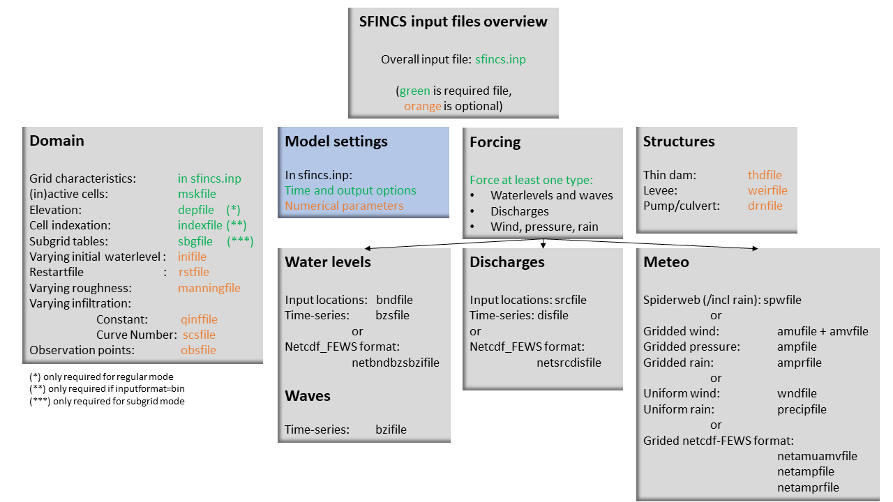

User manual - general
======================

Overview
----------------------

The input for SFINCS is supplied using various text and binary files, which are linked through the main input file: sfincs.inp.
Within this section of the input description all major input settings and files are discussed.
The figure below gives an overview of all different types of input files and whether they are required or not.
Below an example is given of this file, which uses a keyword/value layout. 
For more information regarding specific parameters see the pages 'Input parameters' or 'Output parameters'.

.. figure:: ./figures/SFINCS_documentation_figure1.png
   :width: 800px
   :align: center

   Overview of input file of SFINCS with indication whther they are required or not	
	
Domain
----------------------	

To set up a SFINCS model a number of parameters and files need to be specified to define the domain of the location where a model is being set up for, see the figure below.
This consists of parameters of the grid characteristics in the main sfincs.inp-file and multiple separate input files.
Some of these are required (elevation, active cells, indexfile in case of binary files) and others are optional (roughness, infiltration, subgrid tables, observation points).

.. figure:: ./figures/SFINCS_documentation_domain.png
   :width: 800px
   :align: center
   
Grid characteristics
^^^^^^^^^^^^^^^^^^

SFINCS uses a staggered equidistant recti-linear grid, grid sizes for x- a y-direction can be different. SFINCS can only be used in cartesian coordinates (e.g. UTM zone). 
The grid is initialised by stating an origin location of the cell edges (x0, y0), a number of grid cells in x-&y-direction (mmax, nmax) and the grid sizes in x-&y-direction (dx,dy).
If desired the grid can also be rotated using 'rotation', in degrees from the x-axis (east) in anti-clockwise direction.

.. figure:: ./figures/SFINCS_grid_new.png
   :width: 400px
   :align: center
   
.. code-block:: text
	
	e.g. in sfincs.inp:
	
	x0              = 0
	y0              = 0	
	mmax            = 250
	nmax            = 150
	dx              = 100
	dy              = 100
	rotation        = 45
	
* Matlab example using OET *

.. code-block:: text
	
	inp = sfincs_initialize_input;
	
	inp.x0              = 1000
	inp.y0              = 2000	
	
	sfincs_write_input('sfincs.inp',inp)

Elevation
^^^^^^^^^^^^^^^^^^

To describe the local topography and bathymetry, elevation data has be supplied to the model.
This can be of any multiple of sources, but it is advised that the transition zone between different datasets and between above/below water level are checked with care.
The elevation is described in the cell centres of the grid.

The elevation is defined in sfincs.dep based on the specified grid, positive is upwards with respect to a reference level (topography has positive values, bathymetry has negative values).

**depfile = sfincs.dep**

.. code-block:: text

	<zb x0,y0> <zb x1,y0> 

	<zb x0,y1> <zb x1,y1>

	e.g.
	2.0 	2.2
	1.8	2.4
	
**Matlab example using OET**

.. code-block:: text
	
	z = 5 * ones(2,3);
	msk = ones(2,3);
	
	% inputformat = bin:	
	sfincs_write_binary_inputs(z,msk,inp.indexfile,inp.depfile,inp.mskfile)

	% inputformat = asc:
	sfincs_write_ascii_inputs(z,msk,inp.depfile,inp.mskfile)

Subgrid tables
^^^^^^^^^^^^^^^^^^

Currently the SFINCS model functionality is extended so that SFINCS can also calculated flooding with the use of subgrid tables.
Hereby high-resolution elevation data is used to derive relations between the water level and the volume in a cell to do the continuity update, and a representative water depth used to calculate momentum fluxes.
The derivation of these subgrid tables is a pre-processing step outside of the model, that only needs to be done once!
The advantage of the subgrid version of SFINCS is that generally one can compute on coarsed grid sizes, while still having accurate results utilizing the high-resolution elevation data to its full potential.

Using subgrid features is an advanced option that is not fully supported yet in this documentation.

Mask-file
^^^^^^^^^^^^^^^^^^

To distinguish active from inactive areas and cells where boundary conditions need to be forced, a mask file needs to be supplied.
This mask indicates for every cell whether it is an inactive cell (msk=0), active cell (msk=1), boundary cell (msk=2) or outflow boundary cell msk=3).
This allows great flexibility in optimising the model domain and thereby reducing the computational runtime as much as possible.

If boundary water levels are supplied, these are only forced to the cells with a value of 2. 
Cells with a value of 0 are inactive and no fluxes from/to these cells are calculated.
The file can be made with the OET script 'sfincs_make_mask.m', whereby default a value of -2 m to MSL is used to distinguish the cells.

**mskfile = sfincs.msk**

.. code-block:: text

	<msk (x0,y0)> <msk (x1,y0)>

	<msk (x0,y1)> <msk (x1,y1)>

	e.g.
	0 	1
	2	3
	
**Matlab example using OET**

.. code-block:: text
	
	z = 5 * ones(2,3);
	msk = ones(2,3);
	
	% inputformat = bin:	
	sfincs_write_binary_inputs(z,msk,inp.indexfile,inp.depfile,inp.mskfile)

	% inputformat = asc:
	sfincs_write_ascii_inputs(z,msk,inp.depfile,inp.mskfile)
	
Index file
^^^^^^^^^^^^^^^^^^

Additionally a index file is needed when supplying binary input files (inputformat = bin).
This file is automatically generated when using the Matlab script sfincs_write_binary_inputs as in the example above.

**indexfile = sfincs.ind**

.. code-block:: text

	<cell number 1> <cell number 2> <cell number 3>

Friction
^^^^^^^^^^^^^^^^^^

Different roughness values can great impact modelled flooding and thereby SFINCS allows the specification of a uniform value, differentiating land and sea with 2 different values or specifying a specific value per grid cell.

Friction is specified with a Manning roughness coefficient 'n' [s/m^{1/3}] and can be done spatially uniform, land/sea value based or spatially varying.

Spatially uniform:
%%%%%

Specify the keyword:

.. code-block:: text

	manning = 0.04 (default)

Land/sea value:
%%%%%

For spatially varying a reference level in meters 'rgh_lev_land' is used to distinguish land 'manning_land' (elevation > rgh_lev_land) and sea 'manning_sea' (elevation < rgh_lev_land) with different friction values.

.. code-block:: text

	rgh_lev_land = 0 (default) 

	manning_land = 0.04 

	manning_Sea = 0.02

Spatially varying:
%%%%%

For spatially varying friction values per cell use the manningfile option, with the same grid based input as the depfile using a binary file.

**manningfile = sfincs.man**

.. code-block:: text

	<manning x0,y0> <manning x1,y0> 

	<manning x0,y1> <manning x1,y1>

	e.g.
	0.02 	0.02
	0.06	0.04
	
**Matlab example using OET**

.. code-block:: text
	
	inp.manningfile = 'sfincs.man';
	
	manning = 0.02 * ones(2,3);
	msk = ones(2,3);
	
	sfincs_write_binary_inputs(manning,msk,inp.indexfile,inp.manningfile,inp.mskfile)
	
Infiltration
^^^^^^^^^^^^^^^^^^

Infiltration can significantly alter the amount of flooding when including precipitation.
SFINCS allows the specification of a uniform constant value, spatially varying constant value or the Curve Number method.
The Curve Number is a generally used method to determine what parts of falling rainfall can infiltrate or will run-off, hereby a limited time component is taken into account as well.

Infiltration is specified with either constant in time values in mm/hr (both uniform and spatially varying), or using a Curve Number method (only spatially varying).

Spatially uniform constant in time:
%%%%%

Specify the keyword:

.. code-block:: text

	qinf = 1.0
	
Spatially varying constant in time:
%%%%%

For spatially varying infiltration values per cell use the qinffile option, with the same grid based input as the depfile using a binary file.

**qinffile = sfincs.qinf**

.. code-block:: text

	<infiltrationrate x0,y0> <infiltrationrate x1,y0> 

	<infiltrationrate x0,y1> <infiltrationrate x1,y1>

	e.g.
	1.0 	5.0
	0.0	6.0

**Matlab example using OET**

.. code-block:: text
	
	inp.qinffile = 'sfincs.qinf';
	
	infiltration = 2.2 * ones(2,3);
	msk = ones(2,3);
	
	sfincs_write_binary_inputs(infiltration,msk,inp.indexfile,inp.qinffile,inp.mskfile)

Spatially varying Curve Number:
%%%%%

For spatially varying infiltration values per cell using the Curve Number method use the scsfile option, with the same grid based input as the depfile using a binary file.

**scsfile = sfincs.scs**

.. code-block:: text

	<curve_number_value x0,y0> <curve_number_value x1,y0> 

	<curve_number_value x0,y1> <curve_number_value x1,y1>

	e.g.
	100 	50
	45	60
	
**Matlab example using OET**

.. code-block:: text
	
	curvenumber = 50 * ones(2,3);
	msk = ones(2,3);
	
	sfincs_write_binary_inputs(curvenumber,msk,inp.indexfile,inp.scsfile,inp.mskfile)
	

Observation points
^^^^^^^^^^^^^^^^^^

Observation points with water depth and water level output can be specified.
Per observation point as minimal the x-and y- coordinates are stated, an standard name will then be added per point.
Also, names of a station can be provided with quotes '' (maximum of 256 characters):

**obsfile = sfincs.obs**

.. code-block:: text

	<obs1 x1> <obs1 y1>  <obs1 'name1'>
	
	<obs2 x2> <obs2 y2>  <obs2 'name2'>

	e.g.:
	592727.98 2969420.51 'NOAA_8722548_PGABoulevardBridge,PalmBeach'
	594279.00 2961312.47 'NOAA_8722588_PortofWestPalmBeach'
 	595006.75 2944069.38 'NOAA_8722669_LakeWorthICW'
 	
**Matlab example using OET**

.. code-block:: text
	
	inp.obsfile = 'sfincs.obs';
	obs.x = [592727.98, 594279.00, 595006.75];
	obs.y = [2969420.51, 2961312.47, 2944069.38];
	obs.names = {'NOAA_8722548_PGABoulevardBridge,PalmBeach', 'NOAA_8722588_PortofWestPalmBeach', 'NOAA_8722669_LakeWorthICW'}; 
	
	sfincs_write_obsfile(inp.obsfile,obs)
	 	
 	
Initial water level
^^^^^^^^^^^^^^^^^^

The water level is by default initiated at 0 meters above mean water level, but can be changed.
In the initialisation phase within the model, all cells with an elevation below specified user value are given the specified value of 'zsini', thereby starting without a completely dry bed.
For more flexibility, this can also be prescribed spatially varying which can be relevant for coastal, riverine and tsunami cases.
This 'inifile' is so far only supported using a ascii file.

** zsini **

.. code-block:: text

	zsini = 1.0
	
**inifile = sfincs.ini**

.. code-block:: text

	<zsini_value x0,y0> <zsini_value x1,y0> 

	<zsini_value x0,y1> <zsini_value x1,y1>

	e.g.
	1.0 	1.2
	0.0	0.0
	
* Matlab example*

.. code-block:: text	

	inp.inifile = 'sfincs.ini';
	
	zini=zeros(inp.nmax, inp.mmax);
	zini(:,1:24+1)=0.6;       
	save(inp.inifile,'-ascii','zini');	

Model settings
----------------------

   
Time management
^^^^^^^^^^^^^^^^^^

The required model runtime can be specified by setting a reference date (tref), start date (tstart) and stop date (tstop). 
The format is 'yyyymmdd HHMMSS', see below:

.. code-block:: text

	tref 	= yyyymmdd HHMMSS
	tstart 	= yyyymmdd HHMMSS
	tstop 	= yyyymmdd HHMMSS
	
	e.g.
	tref            = 20180000 000000
	tstart          = 20180000 000000
	tstop           = 20180001 000000	

Also the output date interval can be controlled.
For the map output there is data output every 'dtout' seconds, for optional observation points this is 'dthisout' seconds.
It also possible to get the maximum output data over a specific interval (e.g. every day), specify using 'dtmaxout' in seconds.
When using a spiderweb-file for the wind input, the values are updated every 'dtwnd' seconds.

.. code-block:: text

	dtout 		= 3600
	dtmaxout 	= 86400
	dthisout 	= 600
	dtwnd 		= 1800

Input format 
^^^^^^^^^^^^^^^^^^

The depth/mask/index-files can be binary or ASCII files. 
For the former specify 'inputformat = bin' (default), for the latter specify 'inputformat = asc'.

Output format
^^^^^^^^^^^^^^^^^^

The main map output can be netcdf, binary or ASCII files. 
For the former specify 'outputformat = net' (default), for the others specify 'outputformat = bin' or 'outputformat = asc'.

Output files
^^^^^^^^^^^^^^^^^^

In case of netcdf output the map output will be named 'sfincs_map.nc', in case observation points are provided also a second file will be created with observation point output named 'sfincs_his.nc'.
For binary or ascii files the output will be written to separate files, of which the named can be changed:

.. code-block:: text

	hmaxfile 	= hmax.dat
	zsfile 		= zs.dat
	vmaxfile 	= vmax.dat

Numerical parameters
^^^^^^^^^^^^^^^^^^

* TODO: describe alpha, theta etc

**alpha**
'alpha' is the additional time step limiter besides the courant criteria.
By default this is set to 0.75, in case model simulations become instable for some reason this value can be reduced.
It is recommended to use values within the range [0.1 <> 0.75].

**theta**
'theta' sets the implicitness of the numerical scheme of SFINCS.
The default value is 0.9 which is recommended for the regular version of SFINCS, for the subgrid version a value of 0.95 is recommended.

**advection**
'advection' sets what version of the advection term to use in the momentum equation, varying between the default of no advection at all (advection = 0), 1D advection terms (advection = 1) and full 2D advection terms (advection = 2).
Generally it is only needed to turn on advection in case of modelling waves or super-critical flow.

.. code-block:: text

	alpha 		= 0.75
	theta 		= 0.9
	advection 	= 0
	
Example of sfincs.inp
----------------------

.. code-block:: text

	x0              = 0
	y0              = 0	
	mmax            = 100
	nmax            = 100
	dx              = 100
	dy              = 100
	rotation        = 0
	
	tref            = 20180000 000000
	tstart          = 20180000 000000
	tstop           = 20180001 000000
	
	depfile         = sfincs.dep
	mskfile         = sfincs.msk
	indexfile       = sfincs.ind

	bndfile         = sfincs.bnd
	bzsfile         = sfincs.bzs
	spwfile         = sfincs.spw
	srcfile         = sfincs.src
	disfile         = sfincs.dis

	advection	= 0
	alpha           = 0.75
	huthresh	= 0.05
	manning         = 0.04	
	theta 		= 0.9
	qinf            = 0.0

	dtout           = 3600
	dtmaxout        = 86400	
	dthisout        = 600

	inputformat     = bin
	outputformat    = net	
	
	obsfile         = sfincs.obs  	
