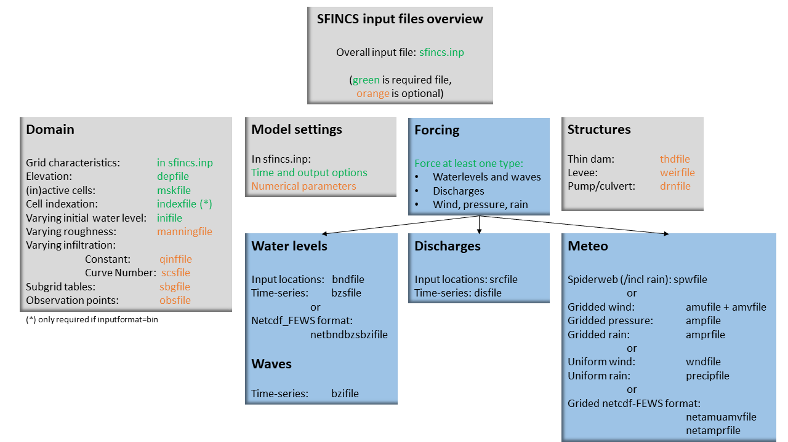

User manual - forcing
=======

Overview
----------------------

The input for SFINCS is supplied using various text and binary files, which are linked through the main input file: sfincs.inp.
Within this section of the user manual all different types of forcing settings and files are discussed.
The figure below gives an overview of all different types of input files and whether they are required or not.
Below an example is given of this file, which uses a keyword/value layout. 
For more information regarding specific parameters see the pages 'Input parameters' or 'Output parameters'.

   Overview of input file of SFINCS with indication whther they are required or not

Forcing
----------------------
SFINCS has different functionalities regarding different relevant physical processes for compound flooding and what type of model is required. 
At first nearshore/offshore water levels can be specified at the different locations along the coast to include tides and storm surge levels. 
Inland drivers of flooding like precipitation and wind can be specified in a number of ways.  
This varies from simple spatially uniform time-series to spatially varying spiderwebs or grid input types.  
Furthermore, simple implementations for discharges are included.

Discussed in this user manual are the water-level boundaries, discharge points, wind, pressure, rain and waves.

Water-level boundaries
^^^^^^^^^

To specify water-level time-series to the boundary cells (msk=2), first the input locations have to be specified in 'sfincs.bnd'.
For every boundary point there is interpolated with a weighted average between the two closest input locations.

**bndfile - sfincs.bnd**

.. code-block:: text

	<bnd1 x1> <bnd1 y1>  
	
	<bnd2 x2> <bnd2 y2>  

	e.g.
	400000 	1200000
	480000 	1250000

Then in the file 'sfincs.bzs' the water level time-series are specified per input location.

**bzsfile = sfincs.bzs**

.. code-block:: text

	<time 1> <zs1 bnd1> <zs1 bnd2>

	<time 2> <zs2 bnd1> <zs2 bnd2>
	
	e.g.
	0 	0.50	0.75
	3600 	0.60	0.80
	7200 	0.45	0.85
	
Waves
^^^^^^^^^

When forcing waves, besides providing a bzsfile with slowly varying water level time-series, also the same type of file with the quickly varying water level component due to waves can be prescribed.
This can contain infragravity and/or short waves.
Do note that the forced signal should be the incoming wave component only, not including the reflecting one, since this is computed by SFINCS internally as well.
The signal should be around 0.
Do note that the input timestep should be the same in both the bzs and bzi files!

**bzifile = sfincs.bzi**

.. code-block:: text

	<time 1> <zi1 bnd1> <zi1 bnd2>

	<time 2> <zi2 bnd1> <zi2 bnd2>
	
	e.g.
	0 	0.05	0.07
	2 	-0.02	-0.04
	4 	0.10	0.03
	
Discharges
---------

Discharge points
^^^^^^^^^

A simple implementation of discharge points is added to SFINCS, specify values in m^3/s. 
First specify the locations in 'sfincs.src'.

**srcfile = sfincs.src**

.. code-block:: text

	<src1 x1> <src1 y1>  
	
	<src2 x2> <src2 y2>  

	e.g.
	300000 	1500000
	380000 	1650000

Discharge time-series
^^^^^^^^^

Then in the file 'sfincs.dis' the discharge time-series are specified per input location.

**disfile = sfincs.dis**

.. code-block:: text
	
	<time 1> <dis1 src1> <dis1 src2>

	<time 2> <dis2 src1> <dis2 src2>

	e.g.
	0 	100	1000
	3600 	300	1100
	7200 	0	1300
	
Meteo
^^^^^^^^^

There are a few different options to specify wind and rain input: 

1) Use a spatially varying spiderweb input (as in Delft3D) for only the wind input, or for the wind as well as the rain input. 

2) Use a spatially varying grid input (as in Delft3D) for u- and v-velocities and/or the rain input. 

3) Use a spatially uniform input for wind and rain, which is faster but also more simplified.

4) Make a combination, for instance use a spiderweb for the wind input and a spatially uniform rain-input. When combining, test whether the forcing is as wanted since not all combinations might be possible.

* TODO: describe netamuamvfile, netamprfile and netbndbzsbzifile and pressure optoins

**Spiderweb-input:**

spwfile = sfincs.spw

**Delft3D-meteo input:**

Wind:

amufile = sfincs.amu

amvfile = sfincs.amv

Rain:

amprfile = sfincs.ampr

These files have this general header of 13 lines which SFINCS expects, after which the TIME and data blocks are given per time frame:

.. code-block:: text

	FileVersion      = 1.03
	filetype         = meteo_on_equidistant_grid
	n_cols           = 2
	n_rows           = 4
	grid_unit        = m
	x_llcorner       = 417328
	y_llcorner       = 3495537
	dx               = 5000
	dy               = 5000
	n_quantity       = 1
	quantity1        = x_wind
	unit1            = m s-1
	NODATA_value     = -999
	TIME = 90831.0 hours since 1970-01-01 00:00:00 +00:00  # 1980-05-12 15:00:00
 	0 0 0 0 
	0 0 0 0
	TIME = 90831.0 hours since 1970-01-01 00:00:00 +00:00  # 1980-05-12 15:00:00
 	0 0 0 0 
	0 0 0 0
	
**Spatially-uniform wind input:**

'vmag' is the wind speed in m/s, 'vdir' is the wind direction in nautical from where the wind is coming. The input format is the same as with Delft3D.

**wndfile = sfincs.wnd**

.. code-block:: text

	<time 1> <vmag1> <vdir1>

	<time 2> <vmag2> <vdir2>

	e.g.
	0 	5	120
	3600 	15	180
	7200 	10	165
	
**Spatially-uniform rain input:**

Rain input in mm/hr.

**precipfile = sfincs.prcp**

.. code-block:: text

	<time 1> <prcp0>

	<time 2> <prcp1>

	e.g.
	0 	0
	3600 	15
	7200 	10
	
**Drag Coefficients:**

The drag coefficients are varying with wind speed and implemented as in Delft3D. 
The default values are based on Vatvani et al. (2012). 
There is specified for how many points 'cd_nr' a velocity 'cd_wnd' and a drag coefficient 'cd_val' is specified, the following are the default values:

.. code-block:: text

	cd_nr = 3 

	cd_wnd = 0 28 50 

	cd_val = 0.0010 0.0025 0.0015 

